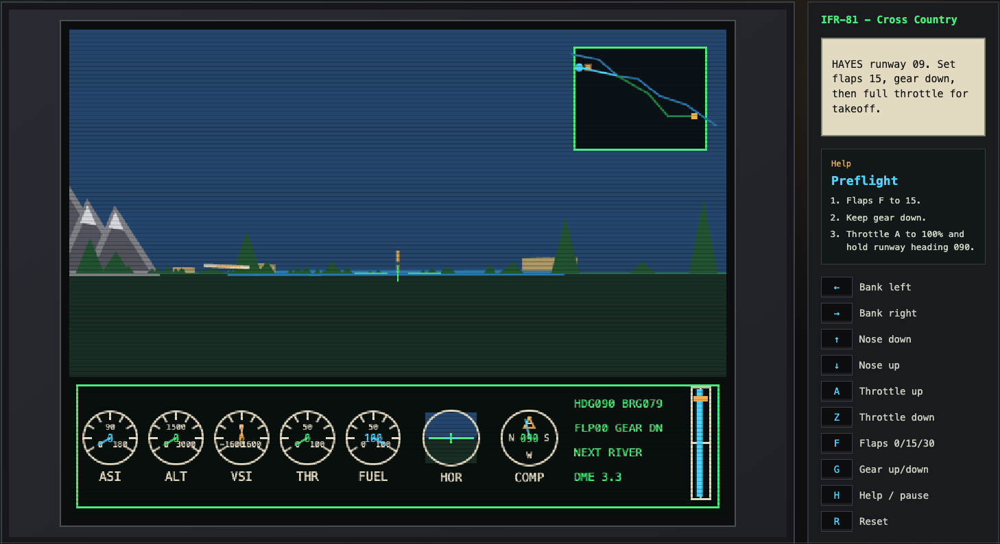

# FlightSim-81

FlightSim-81 is a small browser-based first-person flight simulator inspired by early 8-bit computer flight sims. It focuses on the core pilot workload: take off, climb, follow instruments and map cues to another airport, descend, line up with the runway, and land safely.

The simulator is intentionally simple and chunky, but it includes enough flight behavior to feel like a simulator rather than an arcade sprite game: pitch, bank, throttle, speed, lift, drag, vertical speed, stalls, landing gear, flaps, fuel, terrain clearance, route navigation, and touchdown scoring.



## Play

Open `index.html` in a web browser, or run a local static server:

```bash
python3 -m http.server 4173
```

Then open:

```text
http://localhost:4173
```

Audio starts after the first key press or click because browsers block autoplay sound.

## Mission

Start at HAYES runway 09, take off, follow the map and compass route through the waypoints, then land at NORTHRIDGE runway 09.

The route includes mountains, trees, towns, and a river. The moving map shows the route and the next active waypoint. The cockpit instruction panel updates as the flight phase changes from preflight to takeoff, climb, cruise, approach, landing, and end state.

## Controls

| Key | Action |
| --- | --- |
| Left Arrow | Bank left |
| Right Arrow | Bank right |
| Up Arrow | Nose down |
| Down Arrow | Nose up |
| A | Throttle up |
| Z | Throttle down |
| F | Cycle flaps: 0 / 15 / 30 |
| G | Gear up / down |
| H | Help / pause |
| R | Reset |

## Cockpit Help

### Primary Dials

**ASI** is airspeed in knots. Rotate at about 55-60 kt; approach at 85-105 kt.

**ALT** is altitude above sea level. Cruise near 1600 ft and descend toward FINAL at 900 ft.

**VSI** is vertical speed. Positive climbs, negative descends. Keep touchdown sink gentle.

**THR** is throttle percent. Use full power for takeoff, lower power to descend.

**FUEL** is remaining fuel.

### Attitude And Navigation

**HOR** is the artificial horizon. Blue over green means level; the line tilts with bank and moves with pitch.

**COMP** is the compass. The number is your heading; the cyan needle points toward the next waypoint.

**Map** shows your aircraft, the river, airports, and the route. Follow the cyan line to the active waypoint.

**Right strip** is a course/altitude cue. Keep cyan near center for bearing; amber near center for target altitude.

### Flight Controls

**Arrows** bank and pitch. Up arrow lowers the nose; Down arrow raises it.

**A/Z** increase/decrease throttle.

**F** cycles flaps 0, 15, 30. Use 15 for takeoff and 30 for landing.

**G** raises/lowers landing gear once airborne. Gear must be down for landing.

## In-Flight Guidance

### Preflight

1. Flaps F to 15.
2. Keep gear down.
3. Throttle A to 100% and hold runway heading 090.

### Takeoff

1. At 55-60 kt, ease nose up with Down Arrow.
2. Flaps 15 will help the aircraft fly off.
3. Climb through 300 ft before raising gear.

### Climb

1. Gear up with G.
2. Flaps F to 0 above 500 ft.
3. Climb to about 1600 ft and steer to the map arrow.

### Cruise

1. Follow the cyan bearing pointer and map route.
2. Keep speed 105-145 kt.
3. Stay above terrain and below 2500 ft.

### Approach

1. Descend toward FINAL at 900 ft.
2. Set throttle near 45%.
3. Line up with runway 09.

### Landing

1. Gear down, flaps 30.
2. Aim for 85-105 kt.
3. Touch down gently on the runway with wings level.

### Ended

1. Press R to reset.
2. Score rewards centerline, sink rate, speed, and correct configuration.

## Files

| File | Purpose |
| --- | --- |
| `index.html` | Browser UI, cockpit panel, and help modal |
| `style.css` | Retro cockpit layout and visual styling |
| `game.js` | Flight model, drawing, instruments, route, audio, and game state |
| `assets/Flight-Sim-81.png` | README screenshot |
